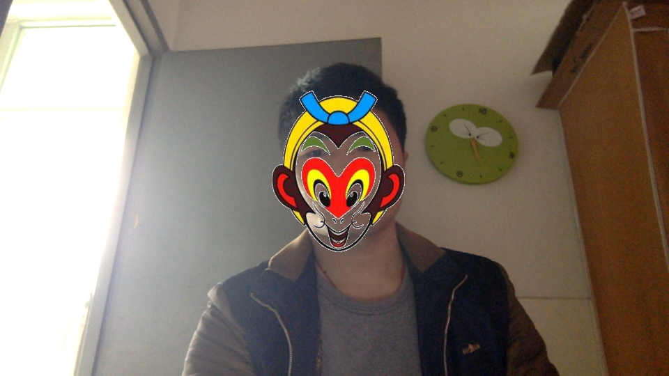

# FaceDetect
Face detect and overlay mask.

# Usage

* create a project
* add **overlayFacemask.cpp**
* add **haarcascade_frontalface_alt.xml**
* add **facemask.png**

# Result

# Note that

> You also need OpenCV3.0+ lib and include!
